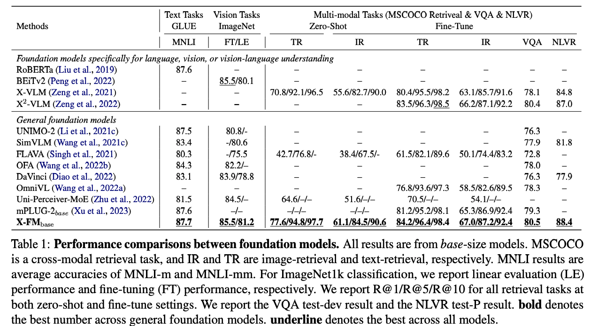
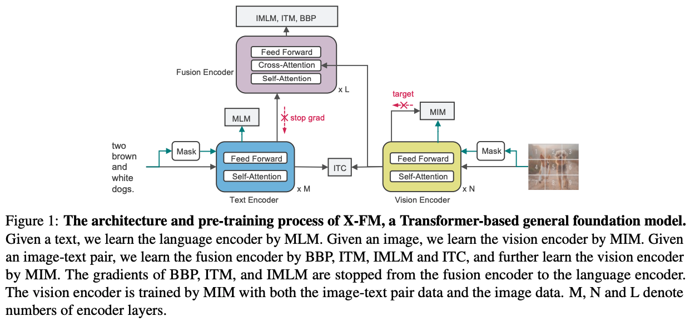
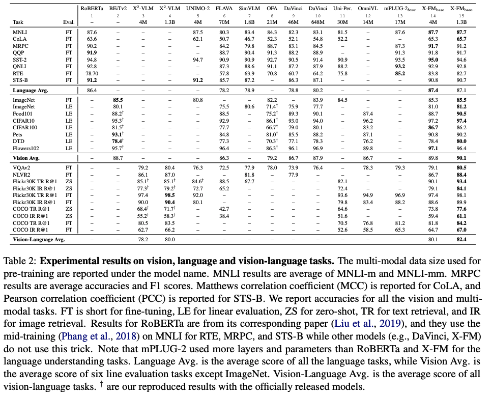
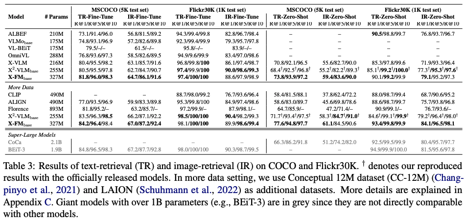
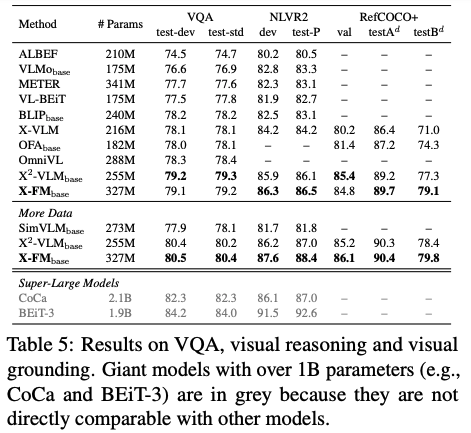
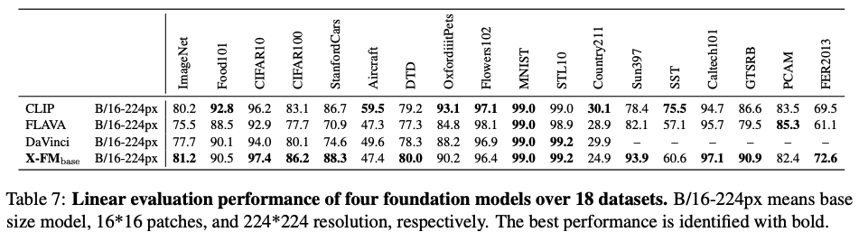

# XFM: Toward Building General Foundation Models for Language, Vision, and Vision-Language Understanding Tasks

**[Toward Building General Foundation Models for Language, Vision, and Vision-Language Understanding Tasks](https://arxiv.org/abs/2301.05065). Xinsong Zhang, Yan Zeng, Jipeng Zhang, Hang Li. arXiv 2023.**

- May 2023: Release the official PyTorch implementation and XFM checkpoints. Note that we are releasing a new version of XFM trained with 1.3B data. Performance is shown below, which has not been updated in the ARXIV paper due to the paper review policy.
- Jan 2023: Release preprint in [arXiv](https://arxiv.org/abs/2301.05065)

XFM Base Size Model Performance (327M parameters). XFM is the BEST base size model in the following tasks:
[](https://paperswithcode.com/sota/cross-modal-retrieval-on-coco-2014?p=toward-building-general-foundation-models-for)
[](https://paperswithcode.com/sota/visual-reasoning-on-nlvr2-dev?p=toward-building-general-foundation-models-for)
[](https://paperswithcode.com/sota/visual-reasoning-on-nlvr2-test?p=toward-building-general-foundation-models-for)
[](https://paperswithcode.com/sota/visual-grounding-on-refcoco-val?p=toward-building-general-foundation-models-for)
[](https://paperswithcode.com/sota/visual-grounding-on-refcoco-testa?p=toward-building-general-foundation-models-for)
[](https://paperswithcode.com/sota/visual-grounding-on-refcoco-test-b?p=toward-building-general-foundation-models-for)


General Performace compared with other foundation models.
<div align="center">
  
</div>

Model architecture and training pipeline.
<div align="center">
  
</div>

Other performance:
<div align="center">
  
</div>
<div align="center">
  
</div>
<div align="center">
  
</div>
<div align="center">
  
</div>


### Pre-Trained Checkpoints
[XFM 1.3B model](https://drive.google.com/file/d/1mM0w4uJW-UdKmXCwIZRWA1hdOuB74s_m/view?usp=sharing) (Recommended)  
[XFM 4M model](https://drive.google.com/file/d/1hTtKxlKLUpw_csR_c_xBRkmOBRCHHY5M/view?usp=sharing) 

### Finetuning Examples
```
# mscoco retrieval
python3 run.py --task "itr_coco" --dist "all" --config "./configs/xfm-ft/Retrieval_coco.yaml" --output_dir "output/itr_coco" --checkpoint "xfm_1b3.th"

# nlvr
python3 run.py --task "nlvr" --dist "all" --config "./configs/xfm-ft/NLVR.yaml" --output_dir "output/nlvr" --checkpoint "xfm_1b3.th"

# vqa
python3 run.py --task "vqa" --dist "all" --config "./configs/xfm-ft/VQA.yaml" --output_dir "output/vqa" --checkpoint "xfm_1b3.th"

# glue mrpc
python3 run.py --task "glue" --dist "all" --config "./configs/xfm-ft/glue_mrpc.yaml" --output_dir "output/vqa" --checkpoint "xfm_1b3.th"

# imagenet
python3 run.py --task "imagenet" --dist "all" --config "./configs/xfm-ft/imagenet1k.yaml" --output_dir "output/vqa" --checkpoint "xfm_1b3.th"

```


## Citation
If you find this repository useful, please considering giving ⭐ or citing:
```
@article{zhang2023toward,
  title={Toward Building General Foundation Models for Language, Vision, and Vision-Language Understanding Tasks},
  author={Zhang, Xinsong and Zeng, Yan and Zhang, Jipeng and Li, Hang},
  journal={arXiv preprint arXiv:2301.05065},
  year={2023}
}
```


### Contact
For issues using this code, please submit a GitHub issue.